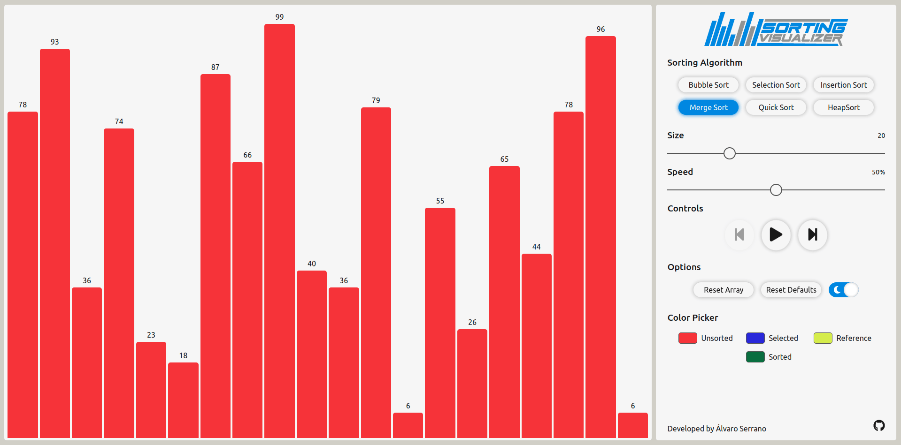

# Sorting Visualizer

I built this visualization tool because I wanted to see sorting algorithms in action. I also wanted to be able to stop the animation and go back/forward. The initial idea for this project was much simpler, and has been evolving overtime, adding new complex features way over my skill level at that moment. Facing these difficult challenges and working my way through them is what has allowed me to improve my coding and problem-solving abilities.

The tech stack consists of React as a Javascript framework and styled-components to add the CSS.

### Sorting Algorithms

- Bubble sort
- Insertion sort
- Selection sort
- Merge Sort
- Quick sort
- Heap sort

### Options

- **Sorting Algorithm:** select from one of the available algorithms.
- **Size:** from 5 to 60.
- **Speed:** from 100% (1 ms delay between steps) to 1% (1000 ms delay between steps). The speed can be modified while the sorting is ongoing.
- **Controls:** play or pause the sorting. When it's paused you can also move one step back/forward.
- **Options**:
  - **Reset Array:** stop the sorting and generate a new array.
  - **Reset Defaults:** stop the sorting and reset everything to its default values (including local storage).
  - **Theme Toggler:** switch between light/dark theme.
- **Color Picker:** change the color of the bars when the sorting is paused.

The sorting algorithm selection and the size slider are disabled once the sorting has started (for obvious reasons). If you want to modify them, either go all the way back until the beginning or reset the array.

### Dependencies

- This project was bootstrapped with [Create React App](https://github.com/facebook/create-react-app).
- [Styled-components](https://styled-components.com/)
- [React-icons](https://react-icons.github.io/react-icons/)

### What I Learned

- Sorting Algorithms: I had to dive deep into them and understand them really well in order to animate each step and handle all the edge cases.
- State management: I learned a lot about the pros/cons of the Context API. I also had to do a fair ammount of optimization to solve performance issues. I believe that a global store like Redux would have been a better choice, specially to get access to the store from outside a component.
- Styling with styled components: css, animations, media queries, nesting, props, theming, extending styles...
- UI/UX: I'm not at all a designer, so coming up with a reasonably well-structured layout was quite challenging. I also tried to have a consistent color scheme, good contrast and a pleasing and intuitive user experience.
- Responsive design: the app adapts nicely to all screen sizes.

### Acknowledgements

- The ripple effect in the buttons was implemented following [this article](https://dev.to/rohanfaiyazkhan/recreating-the-material-design-ripple-effect-in-react-54p).
- The iterative versions of merge sort and quick sort were inspired by [this](https://www.baeldung.com/cs/non-recursive-merge-sort) and [this](https://www.techiedelight.com/iterative-implementation-of-quicksort/) articles, respectively.
- Last but not least, many thanks to [Clément Mihailescu](http://www.clementmihailescu.com/) for being an inspiration to create this project.
